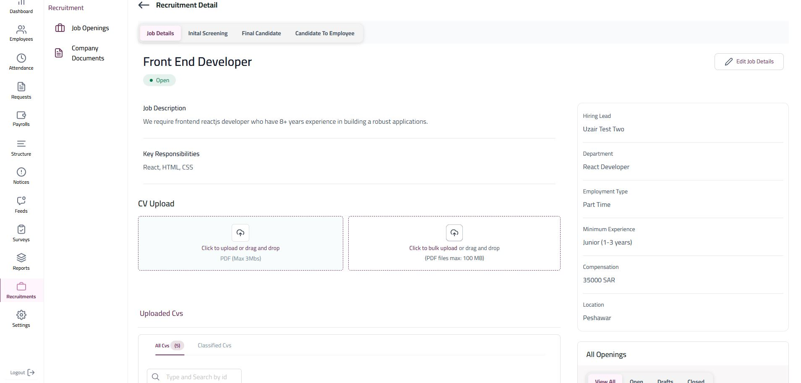
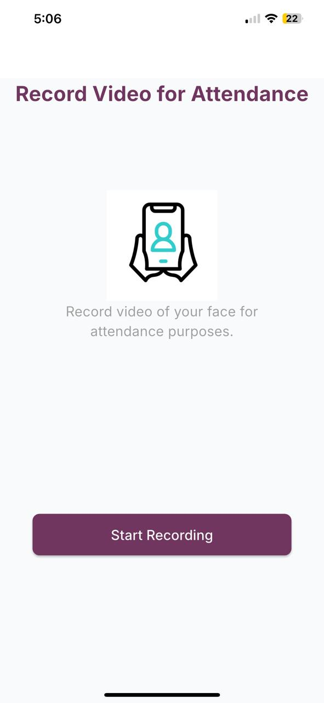

# YouFirst-HRMS

INTRODUCTION

YouFirst HRMS is an end-to-end human resource management system designed to support every stage of the employee journey—from recruitment and onboarding to final settlement. It provides a centralized and intelligent platform that simplifies and enhances HR workflows, ensuring a seamless experience for both HR teams and employees. The system offers a broad range of features, including candidate tracking, automated onboarding processes, employee profile management, attendance and leave tracking, payroll and benefits calculation, performance evaluations, and training management. It also facilitates smooth handling of resignations, exit formalities, and final settlements. With built-in automation, real-time notifications, a customizable dashboard, and role-based access, YouFirst HRMS ensures accuracy, transparency, and efficiency across all HR-related activities. Its scalable architecture makes it suitable for organizations of various sizes and industries, helping them reduce manual workload, improve compliance, and focus more on people development.

SYSTEM FEATURES

1. Employees Profile Management
2. Organizational Structure Management
3. Employee Performance Tracking
4. Training Programs Management
5. Attendance Management With Multi-Shifts Functionality.
6. GeoFencing & Facial Recognition For Attendance
7. Leaves Settlement
8. Request Management With Multi-Layer Approval
9. Payroll Management
10. Notices Management
11. Feeds Like Facebook
12. Employee Satisfiction
13. AI based Recruitement Management

TECNICALITIES/TOOLS USED

1. ASP .NET Core
2. ReactJs
3. Postgres Databases
4. Multi-tenant(SAAS) Architecture
5. GraphQL APIs
8. Flutter

SYSTEM SCREENSHOTS

ADMIN PORTAL

 
 
 
 
 

EMPLOYEE MOBILE APP

       
